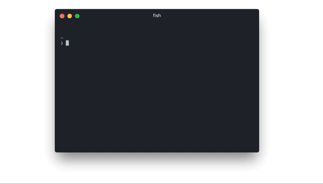

# html-cli  [![stability][0]][1]

> 💄 Pretty print html



[![npm version][2]][3]

## Installation

```
npm install -g html-cli
```

## Usage

```
❯ html

  Pretty print html

  Usage
    $ html <input> [flags]

  Options
    --e4x, --jsx, -x              Pass through JSX/E4X [false]
    --editorconfig, -c            Use .editorconfig for options [false]
    --end-with-newline, -n        Ensure newline at file end [false]
    --eol, -e                     Carriage return character ["\n"]
    --indent-character, -i        Indentation character [" "]
    --indent-level, -l            Initial indentation level [0]
    --indent-size, -s             Indentation size [4]
    --max-preserve-newlines, -m   Count of newlines to preserve per chunk [10]
    --preserve-newlines, -p       Preserve newlines [true]

  Examples
    $ html index.html # overwrites in place

  	$ html docs/**/*.html # overwrites in place

    $ echo "<span>html</span>" | html
    <span>
      html
    </span>

    $ echo "<span>html</span>" > index.html && html < index.html
    <span>
      html
    </span>
```

## License

(c) 2016 Mario Nebl and contributors

(c) 2014-2015 Max Ogden and contributors

## Related

This is based on the awesome work of other people:

*  [maxogden/html](https://github.com/maxogden/commonjs-html-prettyprinter)
*  [beautify-web/js-beautify](https://github.com/beautify-web/js-beautify)

---

[0]: https://img.shields.io/badge/stability-experimental-orange.svg?style=flat-square
[1]: https://nodejs.org/api/documentation.html#documentation_stability_index
[2]: https://img.shields.io/npm/v/html-cli.svg?style=flat-square
[3]: https://npmjs.org/package/html-cli
